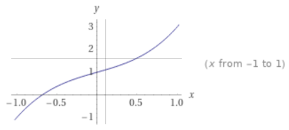
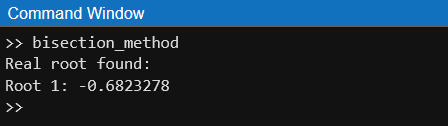
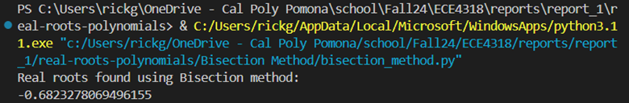
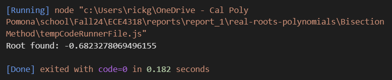
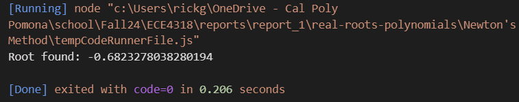
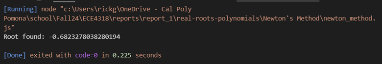
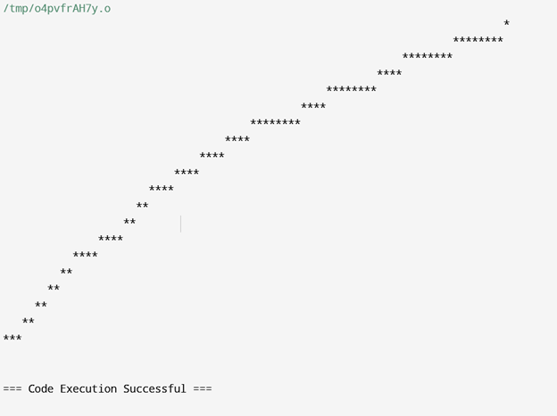
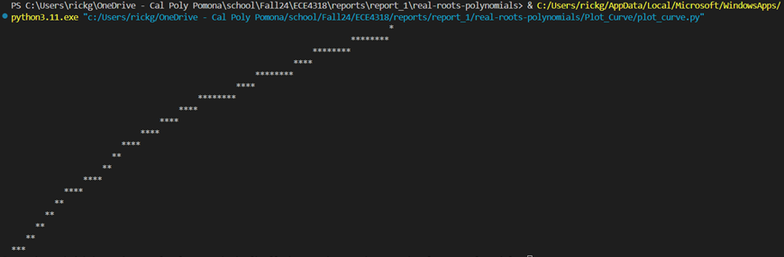
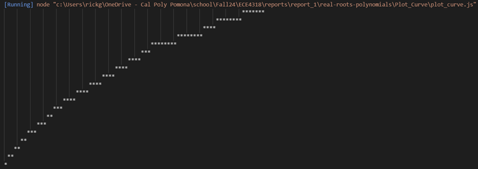
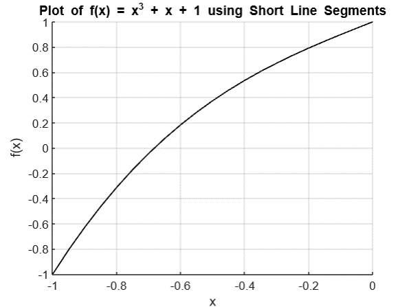

# real-roots-polynomials
ECE 4318 - Software Engineering - Report 1

*Consider the following equation:*

f(x)=x^3+x+1

Through Bisection Method

*Talk about what is Bisection Method*

The Bisection method is a robust numerical technique for finding roots. It works by repeatedly bisecting an interval [a, b] and selecting a subinterval in which a root must lie. This method requires that the function changes sign over the interval [a, b] (i.e., f(a) * f(b) < 0).
Algorithm Steps:
1.	Input: A continuous function f(x)f(x)f(x), an interval [a,b][a, b][a,b] where f(a)×f(b)<0f(a) \times f(b) < 0f(a)×f(b)<0, a tolerance level, and a maximum number of iterations.
2.	Check Signs: Ensure that the function changes sign over the interval [a,b][a, b][a,b]. If not, the method cannot be applied.
3.	Repeat:
•	Calculate the midpoint: c=a+b2c = \frac{a + b}{2}c=2a+b.
•	Evaluate f(c)f(c)f(c).
•	If f(c)f(c)f(c) is close enough to zero (within the tolerance), return ccc as the root.
•	Otherwise, decide which subinterval contains the root:
o	If f(a)×f(c)<0f(a) \times f(c) < 0f(a)×f(c)<0, set b=cb = cb=c.
o	If f(c)×f(b)<0f(c) \times f(b) < 0f(c)×f(b)<0, set a=ca = ca=c.
4.	Stop:
•	If the interval width ∣b−a∣|b - a|∣b−a∣ becomes smaller than the tolerance or the function value at ccc is sufficiently close to zero, return ccc as the approximate root.
•	If the maximum number of iterations is reached without finding the root, the method stops.
The Bisection method is a robust, reliable algorithm for finding roots of continuous functions, particularly when the initial interval is carefully chosen. Although it converges slowly compared to other methods, its simplicity and guaranteed convergence make it useful in many applications.

Created programs to solve the function using Bisection Method.

Using MATLAB

Using Python

Using JavaScript

Through Newton's Method

The Newton method (also known as Newton-Raphson method) is an iterative algorithm used to find the root of a function. It requires both the function and its derivative and works well with a good initial guess.
Algorithm Steps:
1.	Input: A continuous function f(x)f(x)f(x), its derivative f′(x)f'(x)f′(x), an initial guess x0x_0x0, a tolerance, and a maximum number of iterations.
2.	Repeat:
•	Calculate the value of the function f(xn)f(x_n)f(xn) and its derivative f′(xn)f'(x_n)f′(xn) at the current guess xnx_nxn.
•	Update the guess using the Newton-Raphson formula: xn+1=xn−f(xn)f′(xn)x_{n+1} = x_n - \frac{f(x_n)}{f'(x_n)}xn+1=xn−f′(xn)f(xn)
•	Check if the new guess xn+1x_{n+1}xn+1 is close enough to the previous guess xnx_nxn (within tolerance).
3.	Stop:
•	If the difference between successive guesses ∣xn+1−xn∣|x_{n+1} - x_n|∣xn+1−xn∣ is smaller than the tolerance, or if the function value ∣f(xn)∣|f(x_n)|∣f(xn)∣ is close to zero, the algorithm stops, and xn+1x_{n+1}xn+1 is considered the root.
•	If the maximum number of iterations is reached without convergence, the method stops and returns an error message.
•	If f′(xn)=0f'(x_n) = 0f′(xn)=0, stop the iteration to avoid division by zero, as Newton's method cannot proceed in such a case.
Newton's method is a highly efficient algorithm for finding the root of a function, especially when the function is differentiable, and a good initial guess is available. It converges much faster than methods like the Bisection method but requires caution when choosing the initial guess and ensuring the derivative is not zero at the guess points.

Created programs to solve the function using Newton's Method.

Using Python

Using JavaScript

Plotting the function curve

Created programs to graph the function f(x)=x^3+x+1.

Using C

Using Python

Using JavaScript

Using MATLAB

